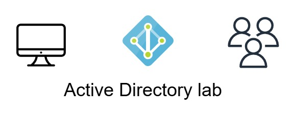
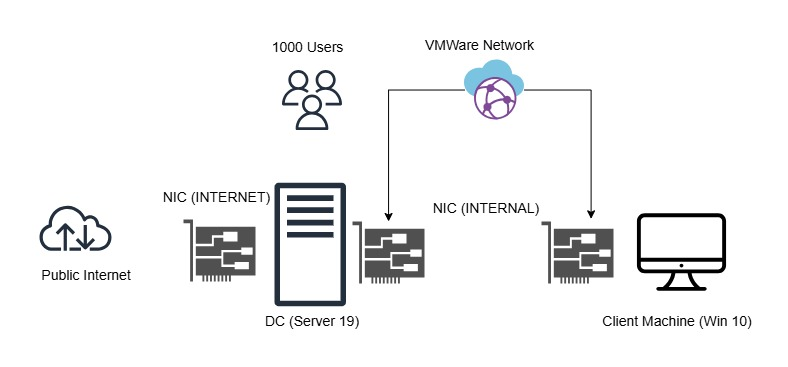
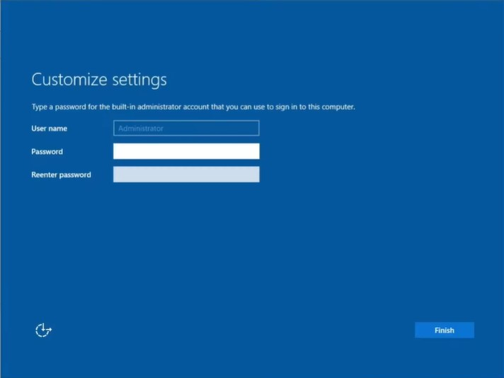
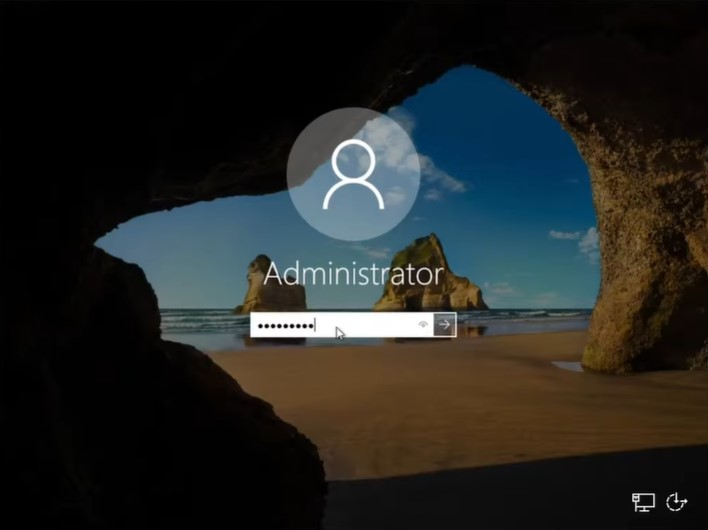
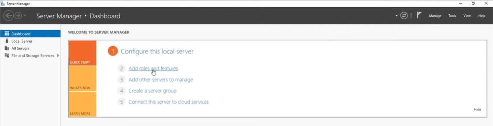
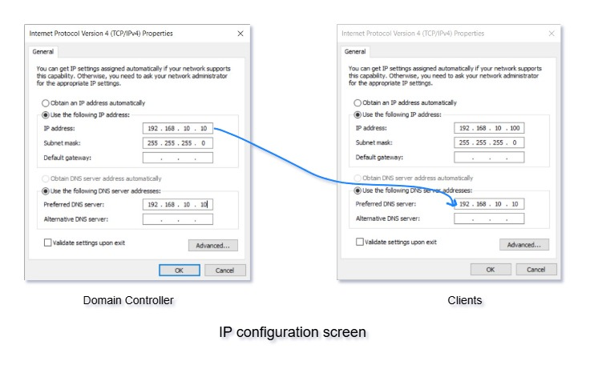
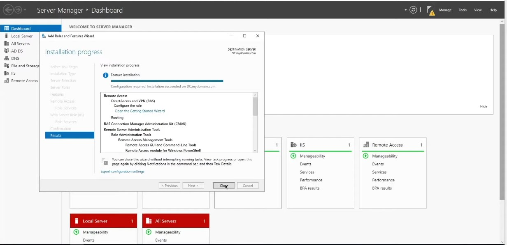
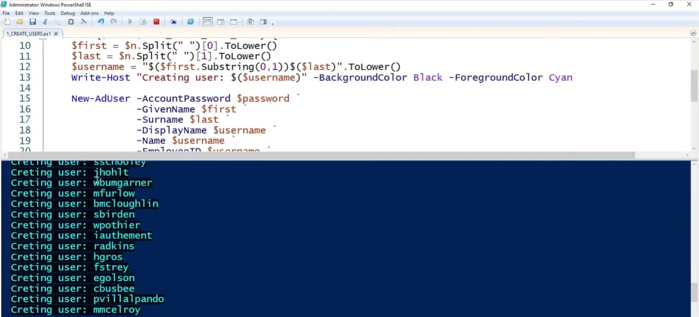
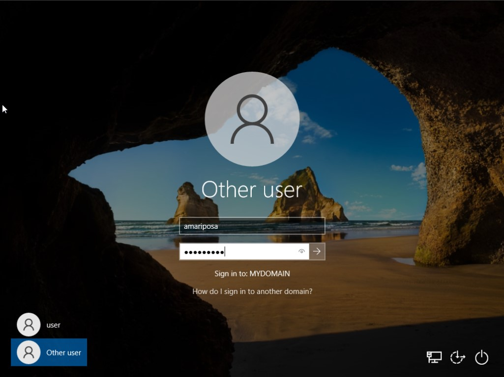

# Active Directory Lab


<p align="center">
  
</p>


## Overview

This lab was designed to simulate a real-world Active Directory environment and provide hands-on experience with configuring a Windows-based network. The goal of this project is to build a detailed understanding of how Active Directory functions while also exploring key Windows networking concepts.

Using Oracle VirtualBox, I created a controlled environment consisting of two virtual machines: one running Windows Server 2019 as the Domain Controller and one running Windows 10 as the client machine.

---

## Objectives


<p align="center">
  
</p>


During this lab, the following tasks were completed:

- Set up Active Directory Domain Services (AD DS) from scratch.
- Create a dedicated Domain Admin account for secure administration.
- Deploy a DHCP server to dynamically assign IP addresses.
- Create an Organizational Unit (OU) to improve user management and organization.
- Configure Routing and Remote Access (RRAS) to simulate a corporate intranet.
- Configure the Network Interface Cards (NICs) to provide both internal communication and internet connectivity.
- Automate mass user creation using PowerShell by generating over 1000 users.
- Log into the Windows 10 client using one of the newly created domain accounts.

---

## Technologies Used

- Oracle VirtualBox  
- Windows Server 2019 ISO  
- Windows 10 ISO  
- PowerShell  

---

## IP Addressing Plan

To ensure proper communication between the Domain Controller and the client machine, the lab was built using a dedicated internal subnet.

| Device | Role | IP Address | Subnet Mask | Default Gateway | DNS Server |
|--------|------|------------|-------------|----------------|------------|
| DC | Domain Controller | 192.168.10.10 | 255.255.255.0 | 192.168.10.1 | 192.168.10.10 |
| CLIENT | Domain Client | DHCP Assigned | 255.255.255.0 | 192.168.10.1 | 192.168.10.10 |

The default gateway (192.168.10.1) is provided by the Routing and Remote Access (RRAS) configuration on the Domain Controller, which allows internal clients to route traffic externally through the server. This setup ensures that all domain authentication and name resolution requests from the client are handled through the Domain Controller.


---


## VirtualBox Network Configuration

A dual NIC configuration was used for the Domain Controller to simulate a realistic enterprise network design.

### Domain Controller (DC) NIC Setup

#### NIC 1 (External / Internet Access)
- **Adapter Type:** NAT  
- **Purpose:** Allows the Domain Controller to access the internet for updates and external connectivity.

#### NIC 2 (Internal / Private Network)
- **Adapter Type:** Internal Network  
- **Purpose:** Allows communication between the Domain Controller and client machine within an isolated environment.

### Windows 10 Client (CLIENT) NIC Setup

- **Adapter Type:** Internal Network  
- **Purpose:** Ensures the client communicates only inside the lab environment and receives its IP configuration from the Domain Controller via DHCP.

This configuration provides an isolated internal network while still allowing the Domain Controller to connect externally through NAT.

---

## Installation

### Create Virtual Machines in VirtualBox

- Open Oracle VirtualBox and click **New**.
- Name the first machine **DC** and select Microsoft Windows as the type and Windows (64-bit) as the version.
- Assign at least **2GB RAM** and create a virtual hard disk of at least **50GB**.
- Repeat the process for the Windows 10 VM and name it **CLIENT**.

---

### Installing the Operating Systems and Initial Setup

After creating the virtual machines, I attached the ISO files and installed both operating systems. The installation process was straightforward, but Windows Server 2019 required additional setup to ensure administrative access.

During the installation:

- Install Windows Server 2019 using the on-screen instructions.

  
 <p align="center">
  
 </p>

 
- Create an administrator account with a strong password since the account will have elevated permissions.


 <p align="center">
  
 </p>

 <p align="center">
  
 </p>


## Integrating Active Directory Domain Services

After booting into Windows Server 2019, I opened **Server Manager** and installed the **Active Directory Domain Services (AD DS)** role.


 <p align="center">
  
 </p>


## Crafting a Domain Admin Account

To create a dedicated Domain Admin account:

- Open **Active Directory Users and Computers**
- Right-click the Users container or OU and select **New > User**
- Create the account and assign a strong password
- Add the account to the **Domain Admins** group

---

## DHCP Configuration Details

To allow the Windows 10 client machine to receive IP configuration automatically, the **DHCP Server** role was installed and configured on the Domain Controller.

### DHCP Setup Steps

- Install the DHCP role via Server Manager
- Authorize the DHCP server inside Active Directory
- Create and activate a DHCP scope

This ensures the client machine receives an IP address dynamically and automatically uses the Domain Controller for DNS resolution.


 <p align="center">
  
 </p>


## Structuring the Organizational Unit

To better organize users and simplify management, an Organizational Unit was created:

- Open **Active Directory Users and Computers**
- Right-click the domain name
- Select **New > Organizational Unit**
- Create a new OU

This lab uses an OU named ```_USERS```.

---

## Routing and Remote Access (RRAS) Configuration

Routing and Remote Access (RRAS) was configured to simulate a real corporate environment where internal machines communicate through a central server.

### RRAS Setup

- Open **Server Manager**
- Add the **Remote Access** role
- Enable **Routing** services
- Configure **Routing and Remote Access**
- Enable NAT routing so internal clients can access the internet through the Domain Controller

### Purpose of RRAS in this Lab

The main reason RRAS was implemented is to allow the internal client machine to route traffic properly while remaining inside the internal network. This mirrors how organizations separate internal workstations from external networks.


 <p align="center">
  
 </p>


## Configure NIC for Internet Access

To ensure the Domain Controller could access the internet:

- Open **Network and Sharing Center**
- Click **Change adapter settings**
- Configure the external NIC to connect through NAT
- Ensure the internal NIC is restricted to the private network only

---

## Bulk User Creation Using PowerShell

In enterprise environments, manually creating large numbers of users is inefficient. To simulate real-world scalability, I automated the creation of over 1000 users using a PowerShell script called ```BulkAddUserScript.ps1```.

This script pulls names from an existing file called ```names.txt``` and generates Active Directory user accounts automatically.

---

## PowerShell Script Breakdown

### Define Variables

The script begins by defining a default password and importing the list of user names from ```names.txt```:

```
    # ----- Edit these Variables for your own Use Case ----- #
    $PASSWORD_FOR_USERS   = "Password1"
    $USER_FIRST_LAST_LIST = Get-Content .\names.txt
    # ------------------------------------------------------ #
```
Two important variables are defined here:

- ```$PASSWORD_FOR_USERS   = "Password1"``` sets a default password for all generated accounts. In this lab environment the password is set to ```"Password1"``` for simplicity. In a production environment, unique passwords or enforced password policies would normally be used.

- ```$USER_FIRST_LAST_LIST = Get-Content .\names.txt``` reads the contents of the ```names.txt``` file. Each line in this file contains a first and last name formatted as "FirstName LastName". This list will be used to generate the user accounts automatically.

---

### Convert Password into Secure String

Active Directory requires passwords to be stored as secure strings rather than plain text. To meet this requirement, the script converts the password into a secure string using the following command:

```
$password = ConvertTo-SecureString $PASSWORD_FOR_USERS -AsPlainText -Force

```
This ensures the password is handled in a format that Active Directory can accept when creating new users.

---

### Create an Organizational Unit

Before creating the users, the script creates a dedicated Organizational Unit named ```_USERS```.

```
New-ADOrganizationalUnit -Name _USERS -ProtectedFromAccidentalDeletion $false

```
Organizational Units help administrators group users and apply policies more effectively.

The parameter ```-ProtectedFromAccidentalDeletion $false``` disables deletion protection. While this is acceptable for a lab environment, production environments typically enable this protection to prevent accidental removal of important directory objects.

---

### Loop Through Names and Generate Usernames

The script then loops through each name in the list and extracts the first and last name.

```
foreach ($n in $USER_FIRST_LAST_LIST) {
    $first = $n.Split(" ")[0].ToLower()
    $last = $n.Split(" ")[1].ToLower()
    $username = "$($first.Substring(0,1))$($last)".ToLower()

```

Several actions occur during this process:

- ```.Split(" ")``` separates the first and last name based on the space between them.

- ```.ToLower()``` converts the text to lowercase for consistency.

- The username is generated by combining:

  - the first letter of the first name

  - the full last name

For example, for the name ```John Doe```, the username will be ```jdoe```.

---

### Display Progress in the Console

While the script runs, it displays progress in the PowerShell console so the administrator can monitor which accounts are being created.

```
Write-Host "Creating user: $($username)" -BackgroundColor Black -ForegroundColor Cyan

```
This output provides visibility into the automation process and helps confirm that the script is functioning correctly.


---

### Create the Active Directory Users

Finally, the script creates each Active Directory account using the ```New-ADUser``` cmdlet.

```
New-AdUser -AccountPassword $password `
           -GivenName $first `
           -Surname $last `
           -DisplayName $username `
           -Name $username `
           -EmployeeID $username `
           -PasswordNeverExpires $true `
           -Path "ou=_USERS,$(([ADSI]"").distinguishedName)" `
           -Enabled $true
}

```
This command defines several attributes for each user account, including:

- GivenName – the user's first name

- Surname – the user's last name

- DisplayName – the username shown in Active Directory

- EmployeeID – assigned using the generated username

- AccountPassword – the secure password defined earlier

- Path – places the user inside the ```_USERS``` Organizational Unit

The parameter ```-PasswordNeverExpires $true``` ensures that passwords do not expire in this lab environment. In production systems, password expiration policies are typically enforced for security reasons.


 <p align="center">
  
 </p>


---

## Why This Matters

The goal of this script is to demonstrate **automation and scalability** in Active Directory environments. Instead of manually creating accounts one by one, PowerShell allows administrators to quickly provision large numbers of users with consistent formatting.

This reflects real-world enterprise workflows where automation is critical for efficiency and helps administrators manage large environments with reduced manual effort.

---

## Client Interaction and Login Testing

After setting up the Windows 10 client machine, it was configured to connect to the internal lab network. The client successfully received an IP address through DHCP.

To validate the configuration, I logged into the system using one of the newly created domain accounts. This simulated the login experience of a typical employee within an organization and confirmed that the Active Directory environment was functioning correctly.


 <p align="center">
  
 </p>


---

## Security Best Practices Demonstrated

Although this project was performed in a lab environment, it demonstrates several important **Active Directory security concepts** used in real-world enterprise systems:

- **Dedicated Domain Admin Account**  
  Separating administrative accounts from standard user accounts reduces the risk of privilege misuse and improves overall system security.

- **Centralized Authentication**  
  Users authenticate through the Domain Controller instead of local machines, allowing administrators to manage access from a central location.

- **Organizational Units (OU)**  
  OUs help enforce structured access control and make user management more scalable across large organizations.

- **Automation with PowerShell**  
  Automation reduces manual errors and improves consistency when creating and managing large numbers of user accounts.

- **Password Policy Awareness**  
  In this lab, the script uses a shared password (`"Password1"`) for simplicity. However, in production environments, strong password policies and password expiration rules are typically enforced to improve security.

---

## Skills Demonstrated

This lab demonstrates several technical skills relevant to **IT administration and cybersecurity**:

- Active Directory Domain Services (AD DS)
- Windows Server 2019 Administration
- DHCP Configuration and IP Address Management
- DNS Fundamentals in Windows Networking
- Routing and Remote Access (RRAS)
- VirtualBox Virtual Network Design (NAT and Internal Networks)
- PowerShell Automation for User Provisioning
- Identity and Access Management (IAM) Concepts

---

## Final Thoughts and Conclusion

This lab provided hands-on experience in building and configuring an Active Directory environment from scratch. It covered essential topics including DHCP configuration, user administration, Organizational Unit structuring, routing setup, and PowerShell automation.

The bulk user creation process highlights how scalable Active Directory environments can be and demonstrates how automation significantly improves efficiency in large organizations.

Active Directory remains one of the most important technologies used in enterprise IT infrastructures. This project serves as a foundational exercise for understanding how corporate Windows environments are designed, deployed, and managed.


